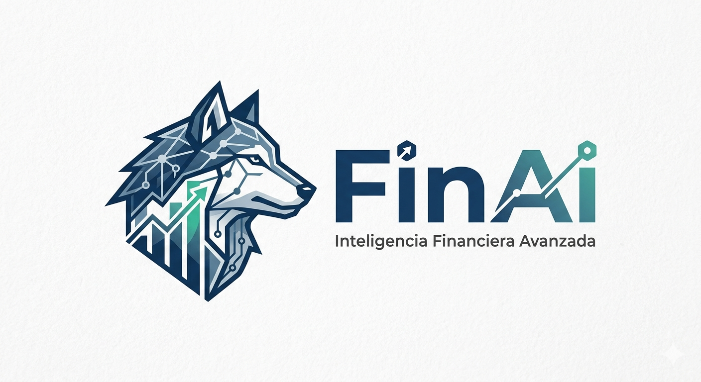

# FinAi

  

## Descripción

FinAi es un sistema de gestión financiera desarrollado como proyecto académico para el SENA. Su objetivo es permitir el registro y control de movimientos financieros, manejo de monedas y administración de tasas de cambio mediante una estructura lógica y organizada.

## Tecnologías Utilizadas

* Python
* Css
* Html
* MySQL
* SQL
* Git y GitHub

## Funcionalidades

* Registro de ingresos y egresos.
* Gestión de monedas.
* Administración de tasas de cambio.
* Control de movimientos financieros.
* Organización y seguimiento de operaciones financieras.

## Información Académica

* Entidad: SENA
* Programa: Análisis y Desarrollo de Software
* Proyecto: FinAi

## Autores

* Luis David Yate
